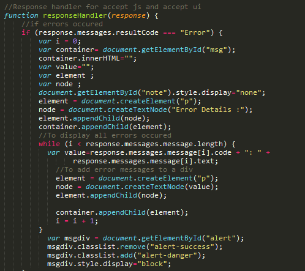
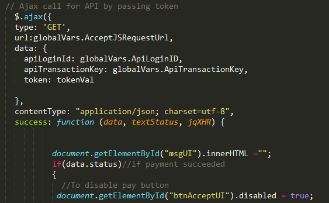

# Accept.js with UI Description

In this we embed the built-in ANET hosted form in our application to capture and send sensitive payment information directly to Authorize.Net.

## Prerequisite

* In Order to utilize the functionality, please provide the below plugin in the HTML file.

SANDBOX: https://jstest.authorize.net/v3/AcceptUI.js    
 
* The functionality for Accept.js with UI is written in pure JavaScript and pages are designed using Bootstrap classes.

## Accessing Accept.js UI Page

There are two ways to navigate to Accept.js UI page.

* The Accept.js UI page can be accessed from the dashboard page by clicking on the Accept.js UI tab. 
* Access directly by providing the product type query string in the URL.
 
The URL format for Accept.js UI is as follows,

https://localhost:PortNumber/index.html?ProductType=Acceptui

## Workflow

Shopping cart information with static content is displayed initially on the page with Pay and Cancel buttons.

On click of Cancel button, the page will be redirected to dashboard page.

The Pay button is defined on the page inside a form and when the customer clicks on the button the payment form will be displayed. 

There is a predefined angular directive for the button, we just need to fill the required values for button dynamically in the script.

Below is the screenshot of existing payment form for Accept.js with UI.

The customer fills the payment information in the form, and clicks the pay button.The Accept script sends the payment information directly to Authorize.Net. 

A response handler function is defined for the Pay button which handles the response of the payment transaction.

This function checks whether the response has any error, if so the errors are displayed on the page.

If there are no errors then the response handler gets the payment nonce/token in the opaqueData from the response.

After receiving the payment nonce / token, we will pass this token along with other required details like ApiLoginID, ApiTransactionKey and AcceptJSRequestUrl through Ajax to invoke the web API.

Based on the response code of the API call whether Success / Failed we will read the response and will display the confirmation page with Thank You message on the screen and with other details like transaction ID and transaction date on successful transaction.

On click of Done button, the page will be redirected to dashboard page.